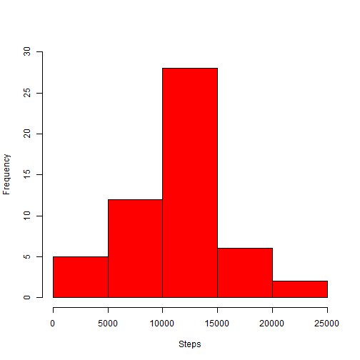
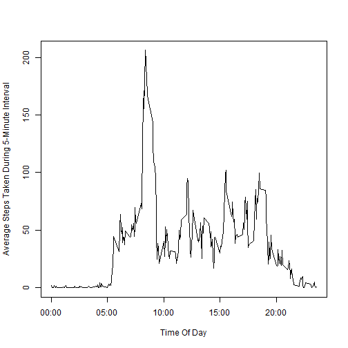
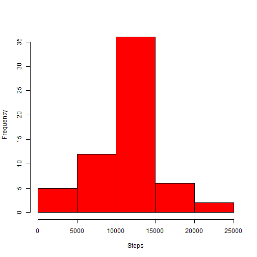
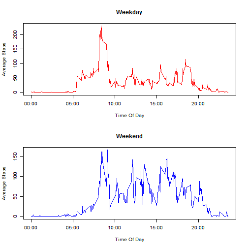

Reproducible Research 2014 - Coursera Assignment 1
========================================================


# **Introduction**

It is now possible to collect a large amount of data about personal movement using activity monitoring devices such as a Fitbit, Nike Fuelband, or Jawbone Up. These type of devices are part of the “quantified self” movement – a group of enthusiasts who take measurements about themselves regularly to improve their health, to find patterns in their behavior, or because they are tech geeks. But these data remain under-utilized both because the raw data are hard to obtain and there is a lack of statistical methods and software for processing and interpreting the data.

This assignment makes use of data from a personal activity monitoring device. This device collects data at 5 minute intervals through out the day. The data consists of two months of data from an anonymous individual collected during the months of October and November, 2012 and include the number of steps taken in 5 minute intervals each day.


# **Data**

The data for this assignment can be downloaded from the course web site:


Dataset: Activity monitoring data [52K] from https://d396qusza40orc.cloudfront.net/repdata%2Fdata%2Factivity.zip


The variables included in this dataset are:
-steps: Number of steps taking in a 5-minute interval (missing values are coded as NA)
-date: The date on which the measurement was taken in YYYY-MM-DD format
-interval: Identifier for the 5-minute interval in which measurement was taken

The dataset is stored in a comma-separated-value (CSV) file and there are a total of 17,568 observations in this dataset.


# **Obtaining and Transformation of the data**

The data file can be downloaded and read into R. Successful loading followed by checking of the contents is advisable. Please note Knitr has issues with obtaining files from https connections, hence setInternet2(True)


```r
setInternet2(TRUE)
temp <- tempfile()
download.file("https://d396qusza40orc.cloudfront.net/repdata%2Fdata%2Factivity.zip", 
    temp)
data <- read.csv(unz(temp, "activity.csv"))
unlink(temp)
```


Contents of the data file:


```r
head(data)
```

```
##   steps       date interval
## 1    NA 2012-10-01        0
## 2    NA 2012-10-01        5
## 3    NA 2012-10-01       10
## 4    NA 2012-10-01       15
## 5    NA 2012-10-01       20
## 6    NA 2012-10-01       25
```

```r
str(data)
```

```
## 'data.frame':	17568 obs. of  3 variables:
##  $ steps   : int  NA NA NA NA NA NA NA NA NA NA ...
##  $ date    : Factor w/ 61 levels "2012-10-01","2012-10-02",..: 1 1 1 1 1 1 1 1 1 1 ...
##  $ interval: int  0 5 10 15 20 25 30 35 40 45 ...
```


The date field would normally be converted to data-formatted values, however leaving the dates as Factor levels will aid further analysis.

# **What are the mean total number of steps taken each day?**

In order to assess the total number of steps taken each day we can create a histogram of the data:


```r
hist(tapply(data$steps, data$date, sum), breaks = 5, xlab = "Steps", main = "", 
    col = "red", ylim = c(0, 30))
```

 


Calculating the mean and median steps taken:

```r
mean_steps <- mean(as.numeric(tapply(data$steps, data$date, sum)), na.rm = TRUE)
```


```
## [1] 10766
```


```r
median_steps <- median(as.numeric(tapply(data$steps, data$date, sum)), na.rm = TRUE)
```

```
## [1] 10765
```


# **What is the average daily activity pattern**

In order to look at the average daily activity pattern, we will create a time series plot of the 5 minute interval (x-axis) and the average number of steps taken, averaged across all day (y-axis). This can be carried out ysing a new data.frame ordered by interval, followed by creating the plot.


```r
data$interval <- as.factor(as.character(data$interval))
interval_mean <- as.numeric(tapply(data$steps, data$interval, mean, na.rm = TRUE))
intervals <- as.numeric(levels(data$interval))
inter_frame <- data.frame(intervals, interval_mean)
inter_frame <- inter_frame[order(inter_frame$intervals), ]
# Plot creation
plot(inter_frame$intervals, inter_frame$interval_mean, type = "l", ylab = "Average Steps Taken During 5-Minute Interval", 
    xlab = "Time Of Day", xaxt = "n")
axis(side = 1, at = 500 * 0:4, labels = c("00:00", "05:00", "10:00", "15:00", 
    "20:00"))
```

 


As can be seen from the graph, the maximum mean appears to be around the 08:00 time, although in order to confirm this value:

```r
sorted <- inter_frame[order(inter_frame$interval_mean), ]
max_interval <- sorted$intervals[dim(sorted)[1]]
```


```
## [1] 835
```

This value corresponds to the 08:35 to 08:40 time interval.

# **Imputing missing values**

Whislt carrying out basic surface analysis of the dataset, several "NA" (missing) values were noticed. Such values often may affect analysis in a detrimental manner.

In order to identify the level of missing data in the data.frame.


```r
summary(data)
```

```
##      steps               date          interval    
##  Min.   :  0.0   2012-10-01:  288   0      :   61  
##  1st Qu.:  0.0   2012-10-02:  288   10     :   61  
##  Median :  0.0   2012-10-03:  288   100    :   61  
##  Mean   : 37.4   2012-10-04:  288   1000   :   61  
##  3rd Qu.: 12.0   2012-10-05:  288   1005   :   61  
##  Max.   :806.0   2012-10-06:  288   1010   :   61  
##  NA's   :2304    (Other)   :15840   (Other):17202
```

```r
dim(data[is.na(data$steps), ])[1]
```

```
## [1] 2304
```

```r
dim(data)[1]
```

```
## [1] 17568
```


Therefore, there are 2304 data entries that lack the steps data out of a  total of 17568 entries. This is  13.1148% of the dataset.

As this is a significant proportion of the data we are analysing, it is worthwhile transforming the data set taking this into account. To do this we calculate the steps for a specific time-step to be equal to the mean of steps at that time point over all other days that do not have a missing "NA" value:


```r
fixed <- vector()
for (i in 1:dim(data)[1]) {
    if (is.na(data$steps[i])) {
        fixed <- c(fixed, inter_frame$interval_mean[inter_frame$intervals == 
            data$interval[i]])
    } else {
        fixed <- c(fixed, data$steps[i])
    }
}
```


Using this vector, we can create a new data set with all "NA" values removed:


```r
data_complete <- data.frame(steps = fixed, date = data$date, interval = data$interval)
head(data_complete)
```

```
##     steps       date interval
## 1 1.71698 2012-10-01        0
## 2 0.33962 2012-10-01        5
## 3 0.13208 2012-10-01       10
## 4 0.15094 2012-10-01       15
## 5 0.07547 2012-10-01       20
## 6 2.09434 2012-10-01       25
```


Now that missing "NA" values have been removed we can again look at a histogram of the dataset:


```r
hist(tapply(data_complete$steps, data_complete$date, sum), breaks = 5, xlab = "Steps", 
    main = "", col = "red")
```

 


It is clear that this histogram is very similar to the original one of the data set including the missing values. However, lets repeat the calculations of mean and median to see how the missing data has effected these values.


```r
mean_steps_complete <- mean(as.numeric(tapply(data_complete$steps, data_complete$date, 
    sum)), na.rm = TRUE)
```


```
## [1] 10766
```


```r
median_steps_complete <- median(as.numeric(tapply(data_complete$steps, data_complete$date, 
    sum)), na.rm = TRUE)
```

```
## [1] 10766
```


As we can see, the values havent change significantly, although this is likely due 
to the fact we didnt remove the entries for those missing values, but replaced them with the mean values of that time point over all other days.

# **Are there differences in activity patterns between weekdays and weekends?**

One might wonder if there is significant changes in the steps taken over weekdays vs weekends. This may be investigated through analysis of the data set, firstly creating a new Factor to indicate weekday vs weekend. Howevere the date entry in the data set will need to be converted to a more suitable data type -


```r
data_complete$date <- as.Date(as.character(data_complete$date), "%Y-%m-%d")
a <- vector()
a[weekdays(data_complete$date) %in% c("Saturday", "Sunday")] = "weekend"
a[!weekdays(data_complete$date) %in% c("Saturday", "Sunday")] = "weekday"
data_complete$day.type <- a
data_complete$day.type <- as.factor(as.character(data_complete$day.type))
```


To clarify the transformation of the date entries of the complete data set with the head function


```r
head(data_complete, 3)
```

```
##    steps       date interval day.type
## 1 1.7170 2012-10-01        0  weekday
## 2 0.3396 2012-10-01        5  weekday
## 3 0.1321 2012-10-01       10  weekday
```

```r
head(data_complete[data_complete$date == "2012-10-6", ], 3)
```

```
##      steps       date interval day.type
## 1441     0 2012-10-06        0  weekend
## 1442     0 2012-10-06        5  weekend
## 1443     0 2012-10-06       10  weekend
```


This confirms that 1st October 2012 was a week day, in fact a Monday, and 6th October 2012 was a weekend (in fact a Saturday).

Using this factor variable we are able to split the data set into weekend and weekday data. With this we can recreate the panel time series plot from earlier:

Firstly we can calculate the mean and median by each day type: weekday and weekend


```r
weekday <- data_complete[data_complete$day.type == "weekday", ]
weekend <- data_complete[data_complete$day.type == "weekend", ]
weekday_means <- as.numeric(tapply(weekday$steps, weekday$interval, mean))
weekend_means <- as.numeric(tapply(weekend$steps, weekend$interval, mean))
```


As before, a new data.frame can be sorted by interval

```r
inter_frame_new <- data.frame(intervals, weekday_means, weekend_means)
inter_frame_new <- inter_frame_new[order(inter_frame_new$intervals), ]
```


Then we can plot this new data:


```r
par(mfrow = c(2, 1), bg = NA, cex = 0.8)
plot(inter_frame_new$intervals, inter_frame_new$weekday_means, type = "l", col = "red", 
    ylab = "Average Steps", xlab = "Time Of Day", main = "Weekday", xaxt = "n")
axis(side = 1, at = 500 * 0:4, labels = c("00:00", "05:00", "10:00", "15:00", 
    "20:00"))
plot(inter_frame_new$intervals, inter_frame_new$weekend_means, type = "l", col = "blue", 
    ylab = "Average Steps", xlab = "Time Of Day", main = "Weekend", xaxt = "n")
axis(side = 1, at = 500 * 0:4, labels = c("00:00", "05:00", "10:00", "15:00", 
    "20:00"))
```

 


From the plots above we can infere that although they appear to be very similar, more activity is noticed around the midday time intervals over the weekend as compared to the weekday. Weekday activity begins slightly earlier than weekend, with a high level of activity around 09:00, likely due to work commute which decreases whilst at work.

Of course these assumptions are made with a single data set, a single individual over only a two month period. Significance of conclusions is therefore difficult to measure.
